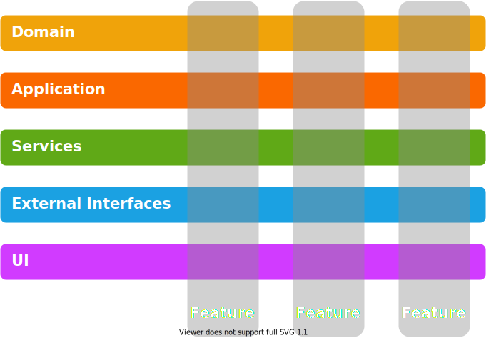
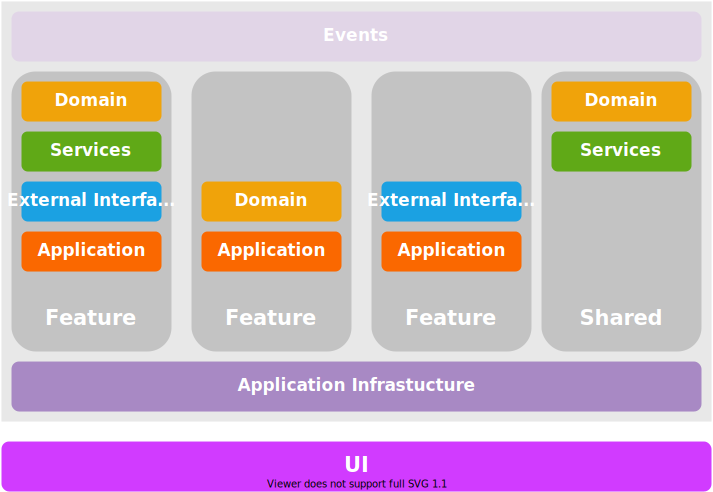

Title: Layers and Features
Published: 25/5/2020
Tags: [General, Vertical Slices]
---

## Background  

Layered Architecture is a well known and proven approach when developing software. But should it always be the default choice?

## Layered Architecture Problems  

By "Layered Architecture" I refer to the class of software architectures using [Layers](https://en.wikipedia.org/wiki/Layer_(object-oriented_design)) and the [Dependency Inversion Principle](https://en.wikipedia.org/wiki/Dependency_inversion_principle). [Onion](https://jeffreypalermo.com/2008/07/the-onion-architecture-part-1/), [Hexagonal](https://en.wikipedia.org/wiki/Hexagonal_architecture_(software)), Ports and Adapters, [Clean](https://blog.cleancoder.com/uncle-bob/2012/08/13/the-clean-architecture.html) are some notable definitions.  

There is no doubt in the benefits of layers and Layered Architecture. Therefore I will go directly to what bothers me about it.   

  

- It is often used as a system-wide architecture. To implement the first features, the layers need to be defined upfront. This means that once layers are in place, every feature should comply with them. The problem is that a decision having such a big impact on future development is made too early.  
  
- Adding a feature requires changes in multiple layers. In the early stages of development or when prototyping some new feature, this can be a burden. Also, future maintenance and development can become complicated.  
  
- Layers enforce abstraction - good layer design is to have an internal and external representation of the entities it handles. There are cases when this does not bring any value, e.g. simple [CRUD](https://en.wikipedia.org/wiki/Create,_read,_update_and_delete) or reporting.  
 
- Sometimes having to go through all layers is an overhead. This is why some define layers as "closed" (it is mandatory to always go through it) and "open" (can be "skipped" in some cases). I don't find this a good practice. Once allowed such "shortcuts" will repeat over time leading to probably "open" all layers thus defeating the purpose.  

- Features tend to have specific requirements. Although layers promote reusability in most cases each layer will have abstractions serving specific features.  

So what can be used as an alternative?   

## Vertical Slices  

[Vertical Slices Architecture](https://jimmybogard.com/vertical-slice-architecture/) moves the boundaries from layers to features. The general idea is to group what is likely to change together.  

  

Verticals slices do not exclude layers. The difference is that decisions can be made on a feature basis. Some features may benefit from a rich domain model and more strict layering and abstractions. For others, a simple [Transaction Script](https://www.martinfowler.com/eaaCatalog/transactionScript.html) may be suitable, or [Event Sourcing](https://martinfowler.com/eaaDev/EventSourcing.html) or [CQRS](https://en.wikipedia.org/wiki/Command%E2%80%93query_separation#Command_query_responsibility_segregation).  

There are some general considerations when using this approach:  

- Make features as independent as possible. Define a clear public interface for other features or the UI layer to use while keeping internal details private.  

- Be very careful when introducing shared components - do not introduce accidental coupling. That said there will be shared domain models and services that will emerge over time. It is normal to have a shared database at least in the beginning.  

- Strive toward reusable Application Infrastructure - security, logging, transactions, exception handling, lifetime scopes. All features should be able to benefit from it and concentrate on the business problem they solve.  

- Do not abandon the Dependency Inversion Principle - there are still benefits from decoupling within a feature.  

- Simple in-memory events or messaging can act as an additional way of decoupling features.  

- My preference is to keep the UI in a separate layer (probably physically separated e.g. in different assembly/package/module). This gives me the flexibility to use different hosts for the application - web server, console application, or system service.  

## Are We Done With the Architecture?  

Unfortunately, the answer is no. Generally speaking, architecture is never done when the software is still under development. I see Vertical Slices as something to start with, not the final thing. It requires attention to the code while it evolves. It means continuous refactoring and restructuring while getting more knowledge for the problem being solved.  

These are some cases that can occur:  

- Two features can depend on each other with circular dependency. Probably this comes from wrongly defined feature boundary and they should be merged in one feature.  

- Multiple features depend on shared service. It is worth revisiting the design and review feature boundaries.  

- Code duplication in multiple features. Investigate whether it is really a code duplication or just a similar code in a different context. If it is really a duplication then it probably should be extracted.   

- Low cohesion within a feature. Probably the feature should be split into separate features.  

- Discover cohesion on the domain level. It possible to find out that the domain itself can be split into parts - a group of features may use given domain entities and a different group can use other entities with little to no crossing points.    

As the requirements change over time there are multiple directions to go. It may be appropriate to start extracting features into [Microservices](https://en.wikipedia.org/wiki/Microservices). The feature's public interface can become an API call. Events feature produces or consumes can be put on an external message queue.  

If it makes sense there is nothing wrong to continue with a monolithic application. Then you can go on with [Modular Monolith](https://www.kamilgrzybek.com/design/modular-monolith-primer/).  

## Conclusion  

Layered Architecture solves a certain class of problems perfectly. But not every project should use it from the start. There is no single architecture that will fit every use case. A project may evolve to layers but should be also flexible enough to be able to accommodate different approaches. Vertical Slices is one possible way to start.    
  
  
