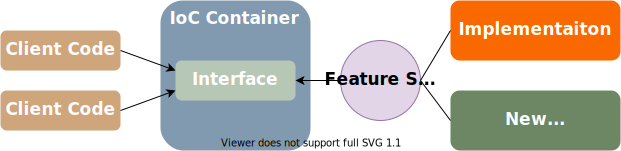
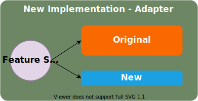
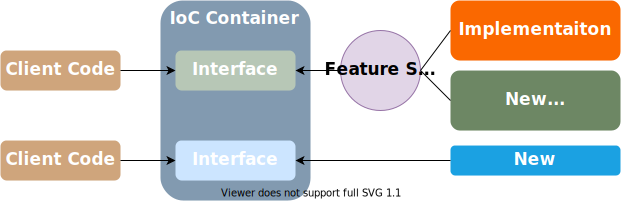

Title: Incremental Code Restructuring
Published: 2020-07-25
Tags: General
---

Feature Switch and Branch by Abstraction are techniques usually mentioned in the context of Trunk Based Development. Nevertheless, when used together, they become a powerful tool for changing existing code. 

## Background  

I wager every successful software that has been growing rapidly for some years has one of those: a component that has too many responsibilities and accidentally coupling various pieces of the system depending on it. In my case, it was an important piece of code that was not designed to be unit-testable (therefore had no single unit test) and was quite complicated on top of it. To do an in-place refactoring we had to first create "seams" so it can be covered with unit tests - a risky affair. So instead of refactoring, we decided to extract functionalities that don't belong to it by re-implementing them.  

## Feature Switch  

The first step was to introduce a [Feature Switch](https://en.wikipedia.org/wiki/Feature_toggle) functionality in our system. I was looking for the simplest thing that will do the job so I ended up with a configuration file values. This means that feature switch configuration is loaded up once at startup and can be changed only with a restart. The approach was good enough - to change a feature switch we had to change the value in our deployment system where we can manage values per environment and redeploy.  

That said there is no need to roll your feature switch implementation - there are plenty of options both open source and commercial.   

*Note: I do a distinction between feature switches and system settings. Although similar, they represent different concepts: feature switches are temporary and preferably short-lived constructs, whether system settings represent multiple different valid behaviors of the system.*

## Branch by Abstraction  

Having feature switches in place it was easy to apply [Branch by Abstraction](https://www.martinfowler.com/bliki/BranchByAbstraction.html) technique.  

  
   
Already having an interface we introduced second implementation and a "main" feature switch - based on it we configured our IoC container.    

## Introduce New Implementation  

The new implementation was nothing but a proxy to the original implementation, dispatching all calls to it. Next, we singled out a functionality we wanted to extract and introduced a specific feature switch to control dispatching the calls to the original or new implementation.  

  

This turned the proxy into an adapter translating the original input and output to the new one. It allowed us to work on the new implementation in isolation without changing the original. The client code that was using the original interface was oblivious that the implementation was different. The feature switch allowed us to gradually roll it through QA, staging, and finally live environments. 

## Transition to New Implementation and Clean Up  

The new implementation was fully covered by unit tests and necessary integration tests. After using it for some time in live environments without issues we were quite confident that it had the same behavior and does not introduce regressions. It was time for the final step.  

  

We removed the methods from the original interface and their corresponding implementation and replaced usages with the new implementation. Also removed the feature switch related to it. Note that this is a breaking change that brings some risk and should be executed with care. Since the new interface and implementation were focused on single responsibility the dependent components were few.

The "main" feature switch remained in place for the next piece of work - we will repeat the same cycle for the remaining features that should be extracted from the original implementation.  

## Fun Fact  

This technique is well known but does not have a distinctive name. Sometimes I refer to it as "Non-Destructive Refactoring" which is true to some extent. For some reason, it sells better to management than "Branch By Abstraction" when you need to convince them it should be done. "Incremental code replacement" is more accurate, but the technique itself is quite simple, and all these names make it sound somewhat more complicated.

## Conclusion  

By using Feature Switch and Branch by Abstraction techniques we achieved smooth transition and we were confident that we can switch implementations along the way only with a configuration change. We achieved the goal to have comprehensive unit and integration tests providing a safety net for future development and to remove a lot of accidental complexity accumulated for years.  
