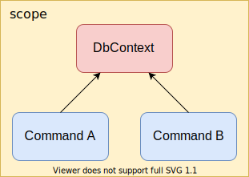
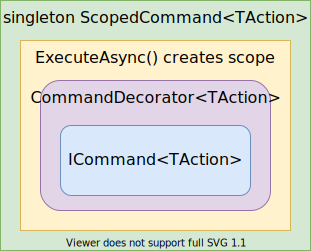

Title: A Case of Decorators with Microsoft DI
Published: 2020-09-16
Tags: [.NET Core]
---

Microsoft.Extensions.DependencyInjection implementation does not support decoration or interception out of the box. Here is how I solved this for a specific case.

## Background

In a project I worked on recently I was using [Microsoft.Extensions.DependencyInjection container](https://docs.microsoft.com/en-us/dotnet/api/microsoft.extensions.dependencyinjection?view=dotnet-plat-ext-3.1){target="_blank"}.
I used a variation of the [Command Pattern](https://en.wikipedia.org/wiki/Command_pattern){target="_blank"} to expose domain logic and I needed to guarantee that every command instance is created and executed in scope, and the scope is then disposed of.  

I wanted commands to be independent, allowing multiple commands to be executed in parallel, or resolved and executed within [hosted services](https://docs.microsoft.com/en-us/aspnet/core/fundamentals/host/hosted-services?view=aspnetcore-3.1&tabs=visual-studio){target="_blank"} or in fire-and-forget scenarios. To illustrate a particular problem: let's say I have two commands depending on EF DbContext, and something depending on both.
Now if DbContext is scoped then I will get two command instances depending internally on the same DbContext instance and if executed in parallel there will be a problem since [DbContext is not thread-safe](https://docs.microsoft.com/en-us/ef/core/miscellaneous/configuring-dbcontext#avoiding-dbcontext-threading-issues){target="_blank"}.



I could register the DbContext as transient but then I have to be sure that scope is disposed of according to [IDisposable guidelines](https://docs.microsoft.com/en-us/aspnet/core/fundamentals/dependency-injection?view=aspnetcore-3.1#general-idisposable-guidelines){target="_blank"}. It is not a problem if my domain lives in ASP .NET Core application since requests are executed in scope by design.
For windows services, hosted services, or console applications though the scope should be managed and I did not want this to be a concern in my domain.  

The [Decorator](https://en.wikipedia.org/wiki/Decorator_pattern){target="_blank"} design pattern seemed like a way to solve it.  


## What I Wanted  

I had a generic abstraction similar to:  

```csharp
public interface ICommand<TAction>
{
    Task ExecuteAsync(TAction action);
}
```
and a simplified implementation can be:

```csharp
public class PrintHelloWorld{ }

public class HelloWorld : ICommand<PrintHelloWorld>
{
    public async Task ExecuteAsync(PrintHelloWorld action) 
        => Console.WriteLine("Hello World!");
}
```
I wanted my domain commands to implement `ICommand<TAction>` and when used by a consumer, something behind the scene to create a scope, resolve the command, execute it, and dispose of the created scope.  

  

I will describe how decoration can be achieved in this case. If you are interested in a more general approach you can jump down to the <a href="#alternatives">Alternatives</a> section.

## Implementing a Decorator to Control scope

So my decorator for controlling scope was something like:  

```csharp
public class ScopedCommand<TAction> : ICommand<TAction>
{
    private IServiceScopeFactory _scopeFactory;

    public ScopedCommand(IServiceScopeFactory scopeFactory)
        => _scopeFactory = scopeFactory;

    public async Task ExecuteAsync(TAction action)
    {
        using var scope = _scopeFactory.CreateScope();
        var command = scope.ServiceProvider.GetRequiredService<ICommand<TAction>>();
        await command.ExecuteAsync(action);
    }
}
```

Nice and easy so far but when I did the registrations I realized it won't work.  

```csharp
serviceCollection.AddTransient<ICommand<PrintHelloWorld>, HelloWorld>()
                 .AddSingleton<ICommand<PrintHelloWorld>, ScopedCommand<PrintHelloWorld>>();
```  

Since I had two registrations for `ICommand<PrintHelloWorld>` the call to `GetRequiredService<ICommand<PrintHelloWorld>>()` will always resolve to `ScopedCommand<PrintHelloWorld>` (last registered wins), and I can't get the `PrintPrintHelloWorld` instance. In fact, the `ExecuteAsync()` call ended up in `StackOverflowException`.  

I could get both instances if I used `GetServices()`:  

```csharp
using(var scope = _scopeFactory.CreateScope())
{
    var commands = scope.ServiceProvider.GetServices<ICommand<TAction>>() as ICommand<TAction>[];
    await command[0].ExecuteAsync(action); 
}
```  

The first registered is the actual command implementation and the second one is the decorator. This works... almost. What if a consumer of this command requests all  `ICommand<PrintHelloWorld>` implementations?  

```csharp
public HelloWorldPrinter(IEnumerable<ICommand<PrintHelloWorld>> commands)
{
    ...
}
```
This is a valid request to the container and it will return both implementations.  

Yet another problem is what if I had two or more implementations of  `ICommand<PrintHelloWorld>` (not taking into account decorators)?  

To solve the problem I registered the `ICommand<TAction>` implementation as itself instead of its interface. But then how `ScopedCommand<TAction>` will know which `ICommand<TAction>` implementation to resolve?  
Appears that this information can be passed as generic type argument:  

```csharp
public class ScopedCommand<TAction, TImplementation> : ICommand<TAction> 
                                                       where TImplementation : ICommand<TAction>
{
    private IServiceScopeFactory _scopeFactory;

    public ScopedCommand(IServiceScopeFactory scopeFactory)
        => _scopeFactory = scopeFactory;

    public async Task ExecuteAsync(TAction action)
    {
        using var scope = _scopeFactory.CreateScope();
        var command = scope.ServiceProvider.GetRequiredService<TImplementation>();
        await command.ExecuteAsync(action);
    }
}
```

so now the registration looked like:  

```csharp
serviceCollection.AddTransient<HelloWorld>()
                 .AddSingleton<ICommand<PrintHelloWorld>, ScopedCommand<PrintHelloWorld, HelloWorld>);
```
and it can be generalized as `ServiceCollection` extension method:  

```csharp
public static IServiceCollection AddCommand<TAction, TImplementation>(this IServiceCollection serviceCollection) 
    where TImplementation : class, ICommand<TAction>
{
    return serviceCollection.AddTransient<TImplementation>()
                            .AddSingleton<ICommand<TAction>, ScopedCommand<TAction, TImplementation>>();
}
```

Now I had implementations of `ICommand<TAction>` in my domain and using the `AddCommand<TAction, TImplementation>()` extension guaranteed me that consumers will actually get `ScopedCommand<TAction, TImplementation>` as implementations.  

This had somewhat of a lazy loading effect: when a consumer gets an implementation it will actually be the `ScopedCommand<TAction, TImplementation>` singleton. Only when the  `ExecuteAsync(TAction action)` method is called the actual implementation will be created, executed, and disposed of. Consequent calls to `ExecuteAsync(TAction action)` will be executed on a new instance.  

As an example this imaginary implementation will be ok because there will be no implicit dependencies on scoped instances:  

```csharp
public class Processor
{
    private IEnumerable<ICommand<ProcessSomeData>> _processors;

    public Processor(IEnumerable<ICommand<ProcessSomeData>> processors)
        => _processors = processors;

    public async Task ProcessAsync()
    {
        var tasks = _processors.Select(x => x.ExecuteAsync(new ProcessSomeData()))
                               .ToArray();
        await Task.WhenAll(tasks);
    }

    public void FireAndForget()
    {
        foreach(var processor in _processors)
        {
            _ = Task.Run(async () => await processor.ExecuteAsync(new ProcessSomeData()));
        }
    }
}
```  

## Adding Command Decorators  

Having `ScopedCommand<TAction, TImplementation>` in place created an opportunity to add any number of decorators between it and the actual `ICommand<TAction>` that is decorated. I introduced a base class for command decorators using method injection (it will be used by `ScopedCommand` to wire-up decorators):     

```csharp
satisfied my requirements public abstract class CommandDecorator<TAction> : ICommand<TAction>
 {
    protected ICommand<TAction> Command { get; private set; }
    public abstract Task ExecuteAsync(TAction action);
    public void SetDecoratee(ICommand<TAction> command) => Command = command;
 }
```

An example decorator can be:  

```csharp
public class SampleHelloWorldDecorator : CommandDecorator<PrintHelloWorld>
{
    public override async Task ExecuteAsync(PrintHelloWorld action)
    {
        Console.WriteLine("----------");
        await Command.ExecuteAsync(action);
        Console.WriteLine("----------");
    }
}
```

The registration is straight-forward. Once again the trick is not to register the decorator by `ICommand<TAction>` interface. An extension method was useful to convey intent:  

```csharp
public static IServiceCollection DecorateCommand<TAction, TImplementation>(this IServiceCollection serviceCollection) 
    where TImplementation : CommandDecorator<TAction>
{
    return serviceCollection.AddTransient<CommandDecorator<TAction>, TImplementation>();
}
```

And finally `ScopedDecorator<TAction>` implementation chained all decorators right before execution of the actual command:

```csharp
public class ScopedCommand<TAction, TImplementation> : ICommand<TAction> 
                                                       where TImplementation : ICommand<TAction>
{
    private IServiceScopeFactory _scopeFactory;

    public ScopedCommand(IServiceScopeFactory scopeFactory)
        => _scopeFactory = scopeFactory;

    public async Task ExecuteAsync(TAction action)
    {
        using var scope = _scopeFactory.CreateScope();
        var command = scope.ServiceProvider.GetRequiredService<TImplementation>();
        
        var decorators = scope.ServiceProvider.GetServices<CommandDecorator<TAction>>() as CommandDecorator<TAction>[];
        if(decorators?.Length > 0)
        {
            decorators[0].SetDecoratee(command);
            for (int i = 1; i < decorators.Length ; i++)
            {
                decorators[i].SetDecoratee(decorators[i - 1]);
            }

            await decorators[^1].ExecuteAsync(action);
        }
        else
        {
            await command.ExecuteAsync(action);
        }
    }
}
```  

The order of decorators is determined by the order of registration. Their execution is in reverse order - the last registered will be the first to execute and so on. Have to admit that registration and execution order always makes me stop and think about it.  

Having for example:

```csharp
serviceCollection.AddCommand<PrintHelloWorld, HelloWorld>()
                 .DecorateCommand<PrintHelloWorld, SampleHelloWorldDecorator>()
                 .DecorateCommand<PrintHelloWorld, AnotherDecorator>();
```

will have execution order: `AnotherDecorator -> SampleHelloWorldDecorator -> HelloWorld`.  

This satisfied my requirements. I added additional classes to support another interface I had: `IQuery<TAction, TResult>`. The implementation is almost the same with one more generic type argument for the result. 

This solution is not perfect but worked for me, so I decided to use it without trying to further generalize it. If more sophisticated use cases come up in the future I have the choice of implementing them or scrape the whole thing in favor of something else.  

<a name="alternatives"></a>
## Alternatives  

This solution fits my requirements and is not a general-purpose one. There are some alternatives I found (by the time of writing):  
 - The first advice is to switch to a different container that supports decorators out of the box.
 - [Scrutor](https://github.com/khellang/Scrutor){target="_blank"} provides assembly scanning and decoration extensions for Microsoft.Extensions.DependencyInjection.
 - [Microsoft.DI.Decorator](https://github.com/VikKol/Microsoft.DI.Decorator){target="_blank"} provides a simple implementation of Decorators in Microsoft.Extensions.DependencyInjection.
 - [Decor.NET](https://github.com/lawrence-laz/Decor.NET){target="_blank"} provides a nice and simple way to execute any code before and after any other method. 
  
## Conclusion  

Lack of support for decoration by Microsoft.Extensions.DependencyInjection implementation hampers one of the benefits of using a container. Nevertheless, it can be overcome either with a custom implementation suiting your needs or by using a third-party solution.  
