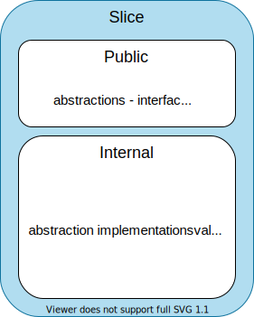
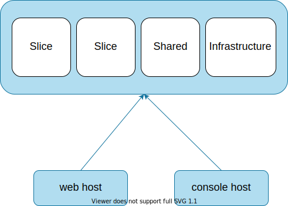
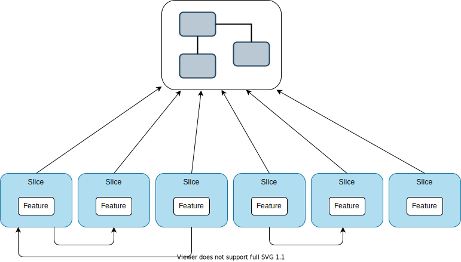
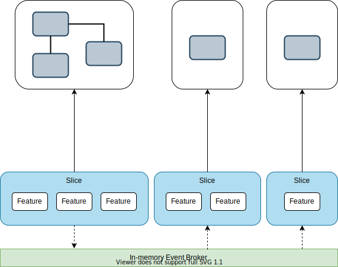

Title: Practical Vertical Slices
Published: 2021-08-01
Tags: [Vertical Slices, General]
---  

Worked recently on a new project and decided to use Vertical Slices approach - this is how it turned out. 

## Background  

The basic idea of Vertical Slices is:

***Keep together what is likely to change together.***   

But what do a slice looks like? I decided to organize my slices like this:  

  

A Vertical Slice represents some functionality in a way that is as autonomous as possible. It consists of a public and internal part. Think about it as somewhat similar to what Bounded Context in DDD is. Look for a strong cohesion within a slice and loose coupling between slices.  

The public part defines its public interfaces along with anything that is intended to be public - abstractions, DTOs, etc. It forms the contract used to interact with it - be it other slices or "external" components, i.e. Web API controller consuming its functionality. 

The internal part consists of all the concrete implementations and everything the slice needs to fulfill its tasks. These implementations are "shielded" by the public part and can be changed at will without breaking dependents, given no breaking changes are introduced to the public contract.

Levels of indirection are decided per slice. For example, if it is implementing some complex domain capability a layered approach and a rich domain model can be beneficial. Another example is simple reporting where projecting a query result directly to DTOs will be sufficient.

This is how my project layout looked like:  
  
  

I decided to keep it simple and put all slices in a single assembly - which was my domain implementation. I hosted it in a web host to provide access to it via Web API and also in a console application for executing some recurring tasks.  

The *Infrastructure* namespace was for the cross-cutting concerns like logging, IoC setup, scope handling, etc. 

The *Shared* namespace is a bit special - shared components introduce coupling. In an ideal world, it will be empty but in reality, this is rarely possible.  

## Implementation  

I started the implementation with slices containing exactly one feature. I was not sure about how the features will relate and didn't want to overthink it. 

The next step was to introduce data storage. I was using a relational database and an ORM and there was the first red flag - my shared database model and by extension, the database was introducing implicit coupling.  

Further down the road, it got even worse. There were a lot of dependencies between slices.  

  

At this point you'll say "hey, this is a total mess" it will be the truth.  

On the positive side, however, I have accomplished two important goals:  
- I had a working proof of concept of my core features and had learned a lot about the domain and the business problems I was solving,
- had technical experience about concrete implementations that worked well and which were not that good and need to be addressed.  

So it was a time to stop adding new features and address the problems armed with the gained knowledge.  

First I looked at the coupling between slices. The slices that were "chatting" too much appeared to be different features serving the same business capability. Also, they were likely to change together, so it was natural to merge them into one slice so they can work together without additional overhead.   
There is nothing wrong with one slice using functionality another slice exposes. Beware of circular dependencies or chained dependencies - it probably means that slice boundaries are not in the right place.  

The second problem - implicit coupling by the data model was more subtle. To analyze the dependencies I wrote down all the slices on one side and all databases entities on the other and connected them based on the usage. It was possible to introduce a separate ORM model per slice but it would solve only half of the problem. The database tables will still be shared between models which will be a pain in the future for sure.  

One of the slices was responsible for ingesting external data and the relational model was working great for the task. The rest of the slices, however, were using only a de-normalized subset of the data. Their data access often consisted of the same four to six SQL joins over data that rarely changes once imported.  

So there was a tradeoff decision - physically de-normalize the data into separate tables at the cost of data duplication. I decided to go this way and it paid off - the slices were now "owning" their database models (and database tables), they were using only the data they needed, and most important the implicit coupling was gone.  

The last piece of the puzzle was propagating the changes from the relational model to its de-normalized versions. There are multiple choices for solving it, for example, using database triggers, or having the slice doing the changes to call other slices.  

My choice was to introduce in-memory events with the publish-subscribe pattern. It is a simple enough decoupling technique, and it has additional benefits I'll address in a bit. This resembles CQRS in a way but is not, since each slice decides how to deal with events and has its own read-write logic.  

This what my final solution looked like:

  

  
## Aftermath  

It appeared that this way of organizing the code had some advantages:  
 - Each slice is dealing only with the data it needs, and since they are stored in separate tables, special indexing can be applied per slice needs.  
 - Utilizing de-normalized data, I can move it to a more suitable storage solution for it, like a document database for example. The decision can be made per slice.  
 - Introducing events opens up additional possibilities, for example, Event Sourcing can be used if feasible. Again the decision can be made per slice.  
 - Events also allow modeling more complex processing without additional coupling, using patterns like Choreography or Orchestration.  
 - Slices can be scaled independently by extracting them into microservices. There is a clear path to it - events to be moved to an external message broker, data to be moved to a separate storage, slice public interface to become an API callable over the network.  

Additionally, using Vertical slices drove me to frequently analyze, revise and refine my domain model and its interactions. Paying attention to the domain cohesion within a slice can result in the merging or splitting of slices. It is all about finding the correct boundaries.   

## Conclusion

I find using Vertical Slices quite appealing. I was able to use an iterative approach, gaining and using knowledge along the way, pairing it with frequent refactoring and adjusting the boundaries of the slices. It resulted in a natural grouping of functionality making the whole solution more understandable and aligned with the business problems.      
