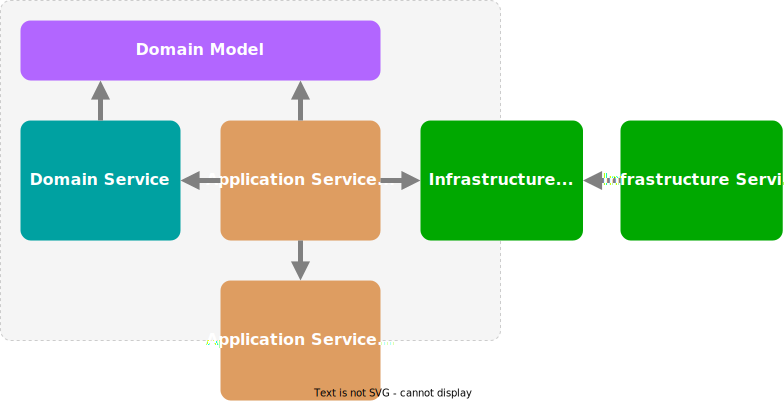

Title: Domain and Application Services
Published: 2022-04-25
Tags: [General]
---  

When we discuss software implementations, we often mention "services". Unfortunately, this is such a loaded term that, without mentioning a context, its meaning becomes unclear.  

## Background  

So let me first define do I mean by service in this blog - service as a source code construct, grouping logically related operations. Service can act as a building block for implementing business logic or other aspect of a software system.  

I will use terms like Domain, Application, and Infrastructure services. Although these are associated with Domain-Driven Design, I'm not trying to describe how to implement DDD. I'm borrowing them as broader, more general terms.  

## Domain Services

Domain Objects encapsulate business operations related to the concept they represent. But sometimes a business logic can't be encapsulated into a single entity without coupling it to one or more other domain entities which may not be appropriate. Here comes into play Domain Services. They implement domain logic and also orchestrate diverse Domain Objects by dispatching related tasks and governing related interactions.  

## Application Services

Application Service often has a double meaning - a service implementing some external concept having abstraction defined in the domain, or a service acting as the domain's facade. I will refer to the latter as an Application Service and the former as an Infrastructure Service.    

## Infrastructure Services  

Infrastructure Services provide essential functionality for the domain but are implemented outside its boundaries. They do not directly implement domain logic, but the domain needs them to complete its tasks. Such services may represent various I/O concerns as database storage, file systems, remote APIs, RPC, REST services, etc. They also may provide features like system clock, security, transactions, instrumentation, messaging, and many more.  
The domain consumes Infrastructure Services, so it defines abstractions for them. This decouples domain logic from the concrete implementations.  
Some Infrastructure Services may even not have specific abstraction defined by the domain. They may handle domain events to accomplish their tasks. For example, an audit trail service may listen to events and store them for later auditing. 

## Application Services  

 Application services exposed by the domain represent its public interface. They are the API for the client (hosting application) to interact with the domain. They also shield the domain by taking and returning simple data structures and providing formal validation for the input.  
 Application Services, similar to Domain Services, are also orchestrators. They coordinate Infrastructure Services, Domain Services, and Domain Objects to complete a business case. Note that an Application Service will make none of the business decisions but delegate them to Domain Services and Objects.  
 An advantage to using Application Services is that they can provide a coarse-grained API representing Use Cases and hiding the fine-grained domain operations. Another advantage is dealing with Infrastructure Services and translating between their abstractions and Domain Objects.   
 
## Putting it all together  

  

The above shows a generalized way of organizing a domain implementation. As always, there is no single solution for all problems and there are many cases when this may not make sense or be an overkill.  

Let's have a brief mention of some pros and cons.  
Pros:  
 - Clean testing strategy - unit tests for Domain Objects and Services covering business logic and integration tests for Application Services covering interactions.  
 - Some of the more technical concerns can live in the Application Services. For example, .NET's `async/await` calls and `Task<T>` results can be entirely in the Application Services, thus having clearer Domain interfaces.  
 - Enforces separation of Data Model (Infrastructure) and Domain Model (Domain). This may be good or bad depending on the system design. For example, if using ORM or a non-relational storage Domain Objects can be persisted directly.  
 - Business logic is encapsulated and Domain is not exposed directly, leading to well-defined boundaries and clear Use Case implementations.  

 Cons:  
 - Using Domain Services extensively without care may lead to an anemic domain model.  
 - Placing strong boundaries leads to more structures and mappings and conversions moving them in and out. Sometimes this is not feasible or practical. If applied carelessly, it may become an unnecessary obstacle.  
 
## Conclusion  

Using Domain, Application, and Infrastructure Services can be beneficial for achieving strong boundaries and business logic encapsulation. Of course, a general recipe will never solve all problems. I believe that a successful software system will have the right mix of approaches for solving concrete problems.  
