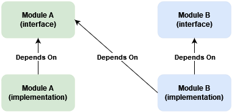
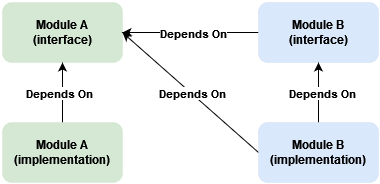
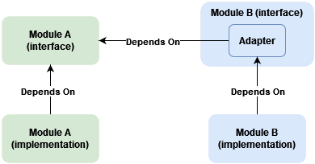

# Module Dependencies Within a Modular Monolith

## Background  

Modules within a modular monolith sometimes depend on other modules. Should such dependencies be made explicit in module public interfaces or can they be considered an implementation detail?  

For clarity, here is my understanding of what a module is: a grouping of logically related classes addressing specific business task or closely related set of tasks. Its implementations are not visible to other modules. A module can expose one or more public interfaces defining operations available for other modules. A module can call (and depend on) another module only through its public interface.  

## The issue  

Let's take for example modules A and B, with an operation from B having to call an operation from A.  

Usually, dependency injection is used to wire up abstractions and implementations. Let's assume the most widespread, constructor injection, is used. This means implementation in B will take a dependency on the interface from A.  

This is not wrong. The dependency can be viewed as implementation detail of module B. However to understand what exactly depends on A, we'll have to dig into B's internals.  

If we look the other way around - we have the code and we want to figure out dependencies. We go through public interfaces and draw a diagram. The dependency is likely to be missed. This is highly probable if we are not familiar with the code base or the domain.   

This gap between the conceptual model and the implementation can be confusing. It may create a discrepancy between documentation and implementation. It can be closed by making dependencies "explicit". In other words - make them a part of the module's public interface.  

Two ways come to mind - switch to method dependency injection or use the adapter design pattern.  

## Method Dependency Injection  

Instead of constructor injection, dependency can be passed as a method parameter. Assuming the method is part of B's public interface, the dependency becomes explicit.  

This doesn't change B's implementation much.  

One drawback is that the responsibility for obtaining the dependency is shifted to the caller. Imagine module C calling B through its interface depending on A. C will have to depend on A without doing anything with A's dependency besides passing it to B. This may be ok in some cases - for example, controller in Backend for Frontend or API Gateway implementation.  

There is at least one case where this approach won't work. If B consumes messages from a message broker and has to call A as part of message handling logic. The handler won't be part of B's public interface.    

## Adapter Design Pattern  

Another solution is to define a similar abstraction in module B and introduce an adapter implementation. B's implementations depend only on B's abstractions. The adapter is injected in B's implementation using constructor injection.  

The trick is to keep the adapter implementation within the public part of module B.  

This is more involved to implement since A's interface and input/output data structures should have similar ones defined in B.  

As an upside - B's interface and input/output data structures representing A's abstraction can be named to reflect better B's purpose. The adapter can "hide" some operations if they are not needed by B's implementation. Changes to A's public interface can be "absorbed" by the adapter, leaving B's dependent implementation unchanged.  

As a downside - the adapter implementation should reside next to B's abstractions. Otherwise, the dependency will again become "hidden" in B's implementation. This should not be much of a problem - the adapter task is to map data structures, forward the call to A, and map and return the result. It should not contain any business logic.  

The adapter being public can lead to possible misuse. Module C can depend on B only to call A through B's adapter, instead of directly depending on A. It's a trade-off between explicit dependency and possible incorrect usage. This kind of misuse can be spotted during review but requires extra attention.  

This approach resolves the problem with private message handlers. The handler can depend on the adapter and use external operations without direct dependency on another module.  

## Conclusion  

As always, a pragmatic approach would be best. It is not wrong to consider module dependencies as an implementation detail. Making dependencies explicit requires additional work and comes with a cost. Nevertheless, it is worth the tradeoff because it makes it easier to reason about and analyze module dependencies. 
